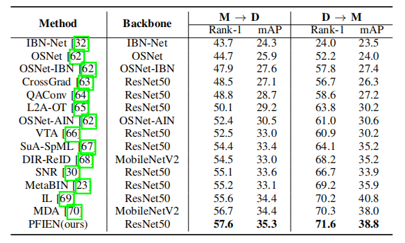
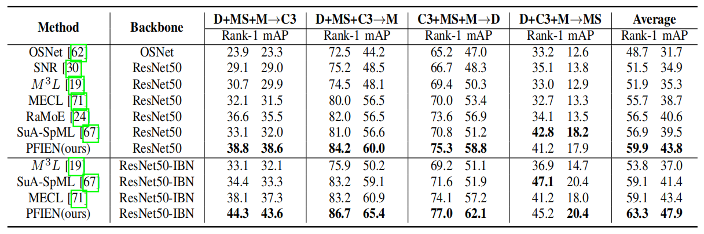

**Domain-invariant Relation Feature Learning with Nuances Exploration for Generalizable Person Re-identification**

Open-source strong baseline for domain generlization re-ID.

We will udpate the strong baseline and PFIEN method as soon as possible~

